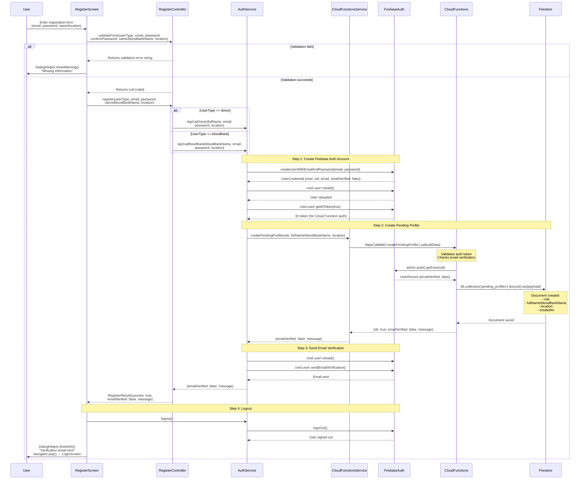
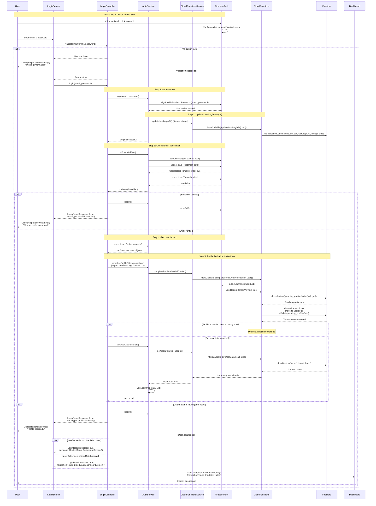
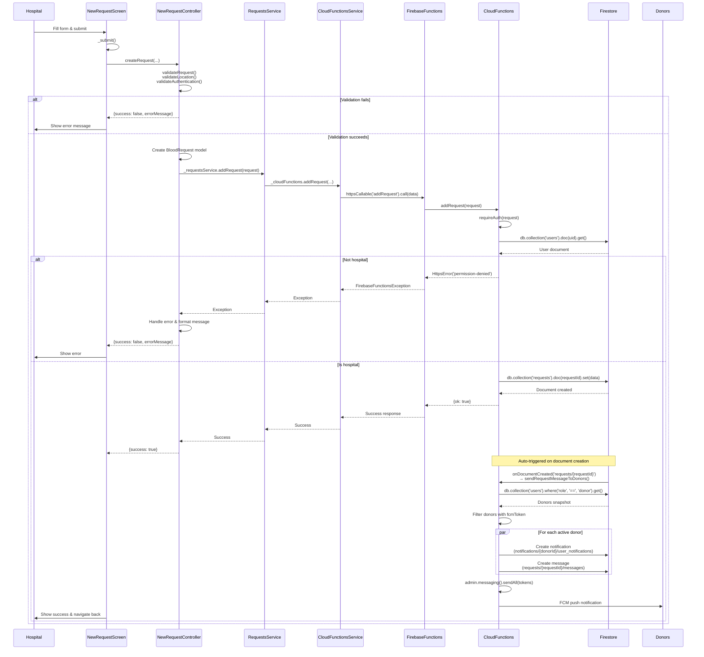

# Detailed Sequence Diagrams - Actual Implementation

This document contains detailed sequence diagrams for the major features, showing actual method calls and class interactions as implemented in the codebase.

---

## Diagram 1: User Registration Flow

### Feature: User Sign Up (Donor or Blood Bank)

This diagram shows the complete registration flow with actual method calls from the implementation.

### Actual Method Calls Sequence:

1. **RegisterScreen._handleSubmit()**
   - Calls: `RegisterController.validateForm()`
   - Calls: `RegisterController.register()`

2. **RegisterController.register()**
   - Calls: `AuthService.signUpDonor()` or `AuthService.signUpBloodBank()`

3. **AuthService.signUpDonor()/signUpBloodBank()**
   - Calls: `FirebaseAuth.createUserWithEmailAndPassword()`
   - Calls: `user.reload()` and `user.getIdToken(true)`
   - Calls: `CloudFunctionsService.createPendingProfile()`
   - Calls: `user.sendEmailVerification()`

4. **CloudFunctionsService.createPendingProfile()**
   - Calls: `FirebaseFunctions.httpsCallable('createPendingProfile').call()`

5. **Cloud Function: createPendingProfile**
   - Calls: `admin.auth().getUser(uid)`
   - Calls: `db.collection('pending_profiles').doc(uid).set()`

---

## Diagram 2: User Login Flow

### Feature: User Authentication & Profile Activation

This diagram shows the complete login flow with actual method calls, including email verification check and profile activation.

### Actual Method Calls Sequence:

1. **LoginScreen._handleLogin()**
   - Calls: `LoginController.validateInput()`
   - Calls: `LoginController.login()`

2. **LoginController.login()**
   - Calls: `AuthService.login()`
   - Calls: `AuthService.isEmailVerified()`
   - Calls: `AuthService.currentUser` (getter)
   - Calls: `AuthService.completeProfileAfterVerification()` (async)
   - Calls: `AuthService.getUserData(uid)` (with retry loop)

3. **AuthService.login()**
   - Calls: `FirebaseAuth.signInWithEmailAndPassword()`
   - Calls: `CloudFunctionsService.updateLastLoginAt()` (async)

4. **AuthService.isEmailVerified()**
   - Gets: `_auth.currentUser`
   - Calls: `user.reload()`
   - Returns: `_auth.currentUser?.emailVerified ?? false`

5. **AuthService.completeProfileAfterVerification()**
   - Calls: `CloudFunctionsService.completeProfileAfterVerification()`

6. **AuthService.getUserData()**
   - Calls: `CloudFunctionsService.getUserData()`
   - Creates: `User.fromMap(data, uid)`

---

## Diagram 3: Create Blood Request Flow

### Feature: Blood Bank Creates Blood Request

This diagram shows the complete flow of creating a blood request, including automatic notification triggering.

### Actual Method Calls:

1. **NewRequestScreen._submit()** (`lib/screens/new_request_screen.dart`)
   - Calls: `_controller.createRequest(...)` - delegates to controller

2. **NewRequestController.createRequest()** (`lib/controllers/new_request_controller.dart`)
   - Validates: `validateRequest()` → `validateLocation()`, `validateAuthentication()`
   - Creates: `BloodRequest` model from parameters
   - Calls: `_requestsService.addRequest(request)`
   - Returns: `{success: bool, errorMessage?: string}`

3. **RequestsService.addRequest()** (`lib/services/requests_service.dart`)
   - Calls: `_cloudFunctions.addRequest(...)` with request parameters

4. **CloudFunctionsService.addRequest()** (`lib/services/cloud_functions_service.dart`)
   - Calls: `_functions.httpsCallable('addRequest').call(data)`

2. **addRequest** (`functions/src/requests.js`)
   - `requireAuth(request)` → extracts uid
   - `db.collection('users').doc(uid).get()` → validate role === 'hospital'
   - `db.collection('requests').doc(requestId).set(data)` → create request

3. **sendRequestMessageToDonors** (`functions/src/requests.js`)
   - Triggered: `onDocumentCreated('requests/{requestId}')`
   - `db.collection('users').where('role', '==', 'donor').get()` → get all donors
   - Filter: Donors with `fcmToken` (active users)
   - Create notifications: `notifications/{donorId}/user_notifications`
   - Create messages: `requests/{requestId}/messages`
   - `admin.messaging().sendAll(tokens)` → send FCM push notifications

---

## Summary of Actual Classes and Methods

### Registration Flow:
- **RegisterScreen**: `_handleSubmit()`
- **RegisterController**: `validateForm()`, `register()`
- **AuthService**: `signUpDonor()`, `signUpBloodBank()`, `logout()`
- **CloudFunctionsService**: `createPendingProfile()`
- **Cloud Function**: `createPendingProfile` → `admin.auth().getUser()`, `db.collection('pending_profiles').doc().set()`

### Login Flow:
- **LoginScreen**: `_handleLogin()`
- **LoginController**: `validateInput()`, `login()`
- **AuthService**: `login()`, `isEmailVerified()`, `currentUser`, `completeProfileAfterVerification()`, `getUserData()`, `logout()`
- **CloudFunctionsService**: `updateLastLoginAt()`, `completeProfileAfterVerification()`, `getUserData()`
- **Cloud Functions**: `updateLastLoginAt`, `completeProfileAfterVerification`, `getUserData`

### Create Request Flow:
- **NewRequestScreen** (`lib/screens/new_request_screen.dart`): `_submit()`
- **FirebaseFunctions**: `instanceFor(region: 'us-central1').httpsCallable('addRequest').call()`
- **addRequest** (`functions/src/requests.js`): `requireAuth()`, `db.collection('users').doc().get()`, `db.collection('requests').doc().set()`
- **sendRequestMessageToDonors** (`functions/src/requests.js`): `onDocumentCreated()`, `db.collection('users').where().get()`, `admin.messaging().sendAll()`

---

*Detailed Sequence Diagrams Generated: 2025*  
*Shows Actual Implementation with Real Method Calls*
