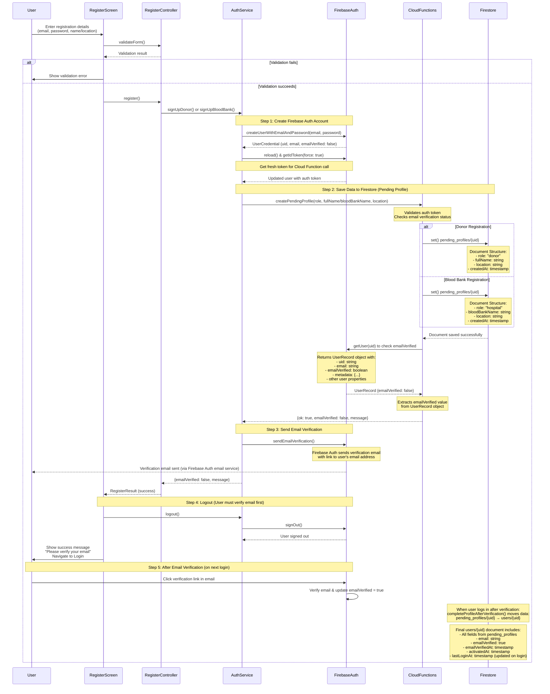
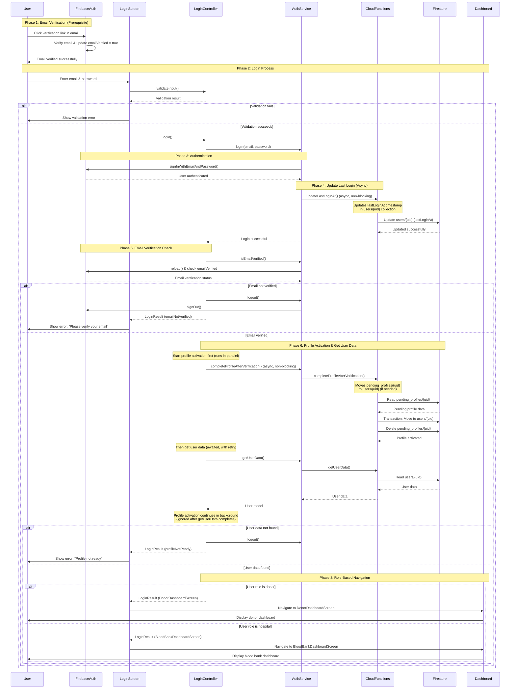
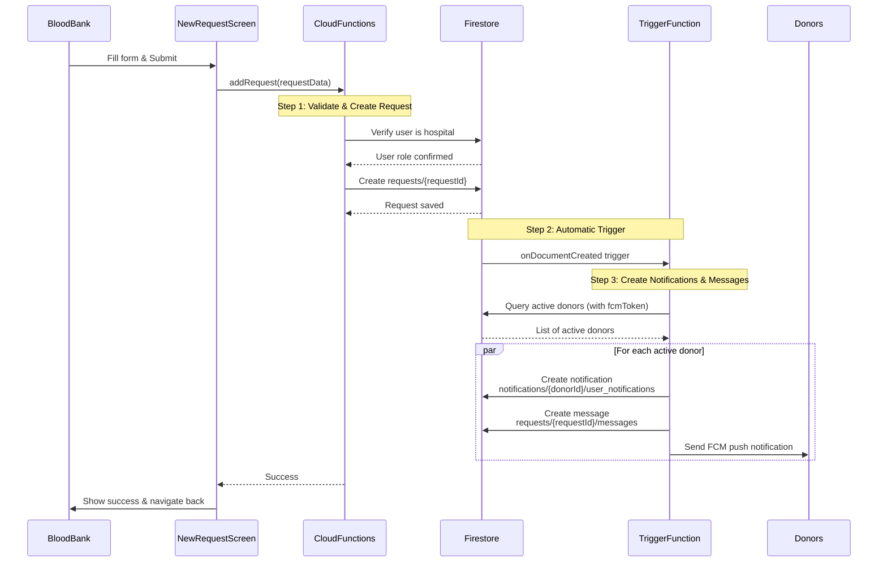
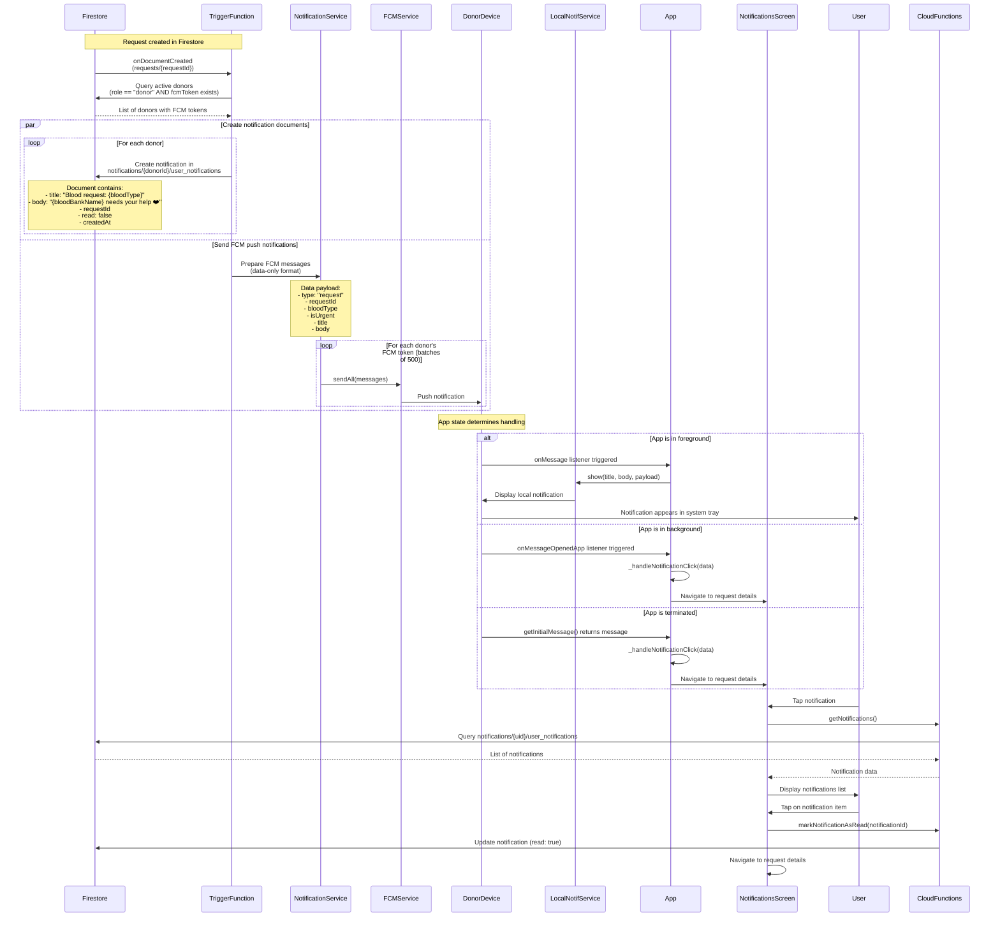

# Sequence Diagrams

This document contains sequence diagrams for the key flows in the Blood Bank Donors application.

## 1. Sign In (Registration) Flow

### Step-by-Step Explanation

The registration process follows a secure, multi-stage approach to ensure email verification before users can access the system. Here's how it works:

#### **Phase 1: User Input & Validation**

1. **User enters registration details**
   - User fills out the registration form with:
     - Email address
     - Password (and confirmation)
     - Name (for donors) or Blood Bank Name (for hospitals)
     - Location (governorate selection)
   - User selects their role: Donor or Blood Bank

2. **Form validation**
   - `RegisterScreen` calls `RegisterController.validateForm()`
   - Validates:
     - Email format (must be valid email)
     - Password strength (minimum 6 characters)
     - Password match (password and confirm password must match)
     - Required fields based on user type
   - If validation fails → Show error message to user
   - If validation succeeds → Proceed to registration

#### **Phase 2: Account Creation**

3. **Create Firebase Auth account**
   - `RegisterController` calls `AuthService.signUpDonor()` or `signUpBloodBank()`
   - `AuthService` calls Firebase Auth: `createUserWithEmailAndPassword(email, password)`
   - Firebase Auth creates a new user account and returns:
     - `uid` (unique user ID)
     - `email`
     - `emailVerified: false` (not verified yet)
   - **Important**: At this point, only the authentication account exists. No profile data is saved yet.

   **How `emailVerified: false` is returned:**
   
   ```dart
   // In AuthService.signUpDonor() or signUpBloodBank()
   cred = await _auth.createUserWithEmailAndPassword(
     email: email.trim(),
     password: password,
   );
   ```
   
   **What `createUserWithEmailAndPassword()` returns:**
   - Returns a `UserCredential` object
   - `UserCredential` contains a `user` property of type `User`
   - The `User` object has an `emailVerified` property
   
   **The `User` object structure:**
   ```dart
   User {
     uid: "abc123...",
     email: "user@example.com",
     emailVerified: false,  // ← This is automatically false for new accounts
     displayName: null,
     // ... other properties
   }
   ```
   
   **Why `emailVerified` is `false`:**
   - Firebase Auth **automatically sets** `emailVerified: false` for all newly created accounts
   - This is a security feature - users must verify their email before accessing the system
   - The value is stored in Firebase Auth's user record (not in Firestore)
   - It remains `false` until the user clicks the verification link in their email
   
   
   **When does it become `true`?**
   - User clicks verification link in email
   - Firebase Auth updates the user record: `emailVerified = true`
   - On next login, `user.emailVerified` will be `true`
   - Cloud Function can then check: `userRecord.emailVerified === true` → returns `true`
   
   **Important Notes:**
   - ✅ `emailVerified` is a property of the Firebase Auth `User` object
   - ✅ It's automatically `false` for all new accounts (Firebase Auth default)
   - ✅ It's stored in Firebase Auth, not Firestore
   - ✅ The value is checked server-side via Cloud Functions for security
   - ✅ Client-side access: `cred.user?.emailVerified` or `_auth.currentUser?.emailVerified`
   - ✅ Server-side access: `admin.auth().getUser(uid).emailVerified`

4. **Get authentication token**
   - `AuthService` reloads the user and gets a fresh ID token
   - This token is required to call Cloud Functions (server-side security)
   - Token proves the user is authenticated

   **Detailed Explanation:**
   
   After creating the Firebase Auth account, the code performs two critical operations:
   
   ```dart
   await cred.user!.reload();
   await cred.user!.getIdToken(true); // force refresh
   ```
   
   **Why reload the user?**
   - When a new user account is created, Firebase Auth may not immediately have all user metadata ready
   - `reload()` fetches the latest user data from Firebase Auth servers
   - Ensures we have the most up-to-date user information before proceeding
   - Updates fields like `emailVerified`, `metadata`, etc.
   
   **What is an ID token?**
   - An ID token is a **JWT (JSON Web Token)** that proves the user is authenticated
   - Contains encrypted information about the user (uid, email, etc.)
   - Has an expiration time (typically 1 hour)
   - Signed by Firebase Auth, so it cannot be forged
   - Example structure:
     ```json
     {
       "uid": "abc123...",
       "email": "user@example.com",
       "email_verified": false,
       "iat": 1234567890,
       "exp": 1234571490
     }
     ```
   
   **Why force refresh (`getIdToken(true)`)?**
   - The `true` parameter forces Firebase to get a **fresh token** from the server
   - Newly created accounts might not have a valid token cached locally
   - Ensures the token is valid and ready to use immediately
   - Without force refresh, we might get a stale or invalid token
   
   **Why is this token critical?**
   - **Security**: Cloud Functions require this token to verify the user is authenticated
   - **Authorization**: The token is sent with every Cloud Function call
   - **Server-side validation**: Cloud Functions extract the `uid` from the token to:
     - Verify the user exists
     - Check user permissions
     - Ensure the user can only access their own data
     - Prevent unauthorized access
   
   **What happens in Cloud Functions?**
   ```javascript
   // Cloud Function receives the request with the token
   const uid = requireAuth(request); // Extracts uid from token
   // Validates token signature
   // Checks token hasn't expired
   // Returns the user's uid if valid
   ```
   
   **What if we skip this step?**
   - ❌ Cloud Function calls might fail with "unauthenticated" error
   - ❌ Token might be missing or invalid
   - ❌ Server cannot verify user identity
   - ❌ Registration process fails
   
   **The Flow:**
   1. User account created → Firebase Auth returns `UserCredential`
   2. Reload user → Get latest user data from Firebase servers
   3. Get fresh token → Request a new, valid ID token
   4. Token cached → Firebase SDK caches the token locally
   5. Token sent → Automatically included in Cloud Function calls
   6. Server validates → Cloud Function verifies token and extracts `uid`
   7. Operation proceeds → Server knows who the user is and can authorize actions

#### **Phase 3: Save Profile Data (Pending State)**

5. **Save to pending_profiles collection**
   - `AuthService` calls Cloud Function: `createPendingProfile()`
   - Cloud Function validates:
     - User is authenticated (checks auth token)
     - Required fields are provided
     - Role is valid ("donor" or "hospital")
   
   - **For Donor**: Cloud Function saves to Firestore:
     ```
     pending_profiles/{uid} = {
       role: "donor",
       fullName: "John Doe",
       location: "Amman",
       createdAt: serverTimestamp()
     }
     ```
   
   - **For Blood Bank**: Cloud Function saves to Firestore:
     ```
     pending_profiles/{uid} = {
       role: "hospital",
       bloodBankName: "City Hospital",
       location: "Amman",
       createdAt: serverTimestamp()
     }
     ```
   
   - **Why "pending"?** Because the user's email is not verified yet. The profile is in a temporary state.

6. **Check email verification status**
   - Cloud Function checks if email is already verified (usually false at this point)
   - Returns status to `AuthService`

#### **Phase 4: Email Verification**

7. **Send verification email**
   - `AuthService` calls Firebase Auth: `sendEmailVerification()`
   - Firebase Auth handles email sending internally (no separate email service)
   - Email contains a verification link
   - User receives the email in their inbox

8. **Show success message**
   - `RegisterController` returns success result to `RegisterScreen`
   - User sees message: "We sent you a verification email. Please check your inbox."

#### **Phase 5: Logout & Redirect**

9. **Automatic logout**
   - `RegisterScreen` calls `AuthService.logout()`
   - User is signed out from Firebase Auth
   - **Why logout?** Because the user must verify their email before they can log in
   - User is redirected to the Login screen

#### **Phase 6: Email Verification (User Action)**

10. **User clicks verification link**
    - User opens their email and clicks the verification link
    - Link takes them to Firebase Auth verification page
    - Firebase Auth verifies the email and updates: `emailVerified = true`
    - User's email is now verified

#### **Phase 7: Profile Activation (On First Login)**

11. **User logs in after verification**
    - User goes to Login screen and enters credentials
    - During login, `completeProfileAfterVerification()` is called
    - Cloud Function performs atomic transaction:
      - Reads data from `pending_profiles/{uid}`
      - Creates document in `users/{uid}` with:
        - All data from pending_profiles
        - `email`: user's email address
        - `emailVerified: true`
        - `emailVerifiedAt`: timestamp
        - `activatedAt`: timestamp
      - Deletes `pending_profiles/{uid}` document
    - Profile is now **activated** and user can access the system

### Key Points

✅ **Security**: All database operations go through Cloud Functions (no direct Firestore access from client)

✅ **Two-stage storage**: 
   - First: `pending_profiles/{uid}` (temporary, before verification)
   - Second: `users/{uid}` (permanent, after verification)

✅ **Email verification required**: Users cannot access the system until email is verified

✅ **Atomic migration**: Profile activation uses a transaction to ensure data consistency

✅ **Automatic cleanup**: Unverified accounts can be automatically deleted after a period



### Firestore Data Storage Details

The registration process uses a **two-stage data storage approach** for security and email verification:

#### Stage 1: Pending Profile (`pending_profiles/{uid}`)
When a user registers, their data is **first saved** to the `pending_profiles` collection:

**For Donor:**
```javascript
pending_profiles/{uid} = {
  role: "donor",
  fullName: "John Doe",
  location: "Amman",
  createdAt: Timestamp
}
```

**For Blood Bank:**
```javascript
pending_profiles/{uid} = {
  role: "hospital",
  bloodBankName: "City Hospital",
  location: "Amman",
  createdAt: Timestamp
}
```

**Why pending_profiles?**
- User's email is not yet verified
- Profile is not yet activated
- Prevents unverified users from accessing the system
- Can be cleaned up if email is never verified

#### Stage 2: Active Profile (`users/{uid}`)
After email verification and first login, data is **moved** from `pending_profiles` to `users` collection:

**For Donor:**
```javascript
users/{uid} = {
  role: "donor",
  fullName: "John Doe",
  location: "Amman",
  email: "user@example.com",
  emailVerified: true,
  emailVerifiedAt: Timestamp,
  activatedAt: Timestamp,
  createdAt: Timestamp,
  lastLoginAt: Timestamp,
  fcmToken: "..." (added on login)
}
```

**For Blood Bank:**
```javascript
users/{uid} = {
  role: "hospital",
  bloodBankName: "City Hospital",
  location: "Amman",
  email: "hospital@example.com",
  emailVerified: true,
  emailVerifiedAt: Timestamp,
  activatedAt: Timestamp,
  createdAt: Timestamp,
  lastLoginAt: Timestamp,
  fcmToken: "..." (added on login)
}
```

**Migration Process:**
1. User verifies email via link
2. On first login after verification, `completeProfileAfterVerification()` is called
3. Cloud Function performs atomic transaction:
   - Reads data from `pending_profiles/{uid}`
   - Creates/updates document in `users/{uid}` with additional fields
   - Deletes `pending_profiles/{uid}` document
4. Sets custom claims in Firebase Auth for role-based access

**Security Benefits:**
- ✅ No direct Firestore access from client (all via Cloud Functions)
- ✅ Email verification required before profile activation
- ✅ Atomic transaction ensures data consistency
- ✅ Automatic cleanup of unverified accounts

## 2. Login Flow

### Step-by-Step Explanation

The login process ensures users have verified their email and have an activated profile before accessing the system. Here's how it works:

#### **Phase 1: Email Verification (Prerequisite)**

1. **User receives verification email**
   - After registration, user receives verification email from Firebase Auth
   - Email contains a verification link

2. **User clicks verification link**
   - User opens email and clicks the verification link
   - Link redirects to Firebase Auth verification page
   - Firebase Auth verifies the email and updates: `emailVerified = true`
   - User's email is now verified in Firebase Auth

#### **Phase 2: User Input & Validation**

3. **User enters credentials**
   - User navigates to Login screen
   - User enters email and password
   - `LoginScreen` calls `LoginController.validateInput()`
   - Validates email and password are not empty
   - If validation fails → Show error message
   - If validation succeeds → Proceed to authentication

#### **Phase 3: Authentication**

4. **Authenticate with Firebase Auth**
   - `LoginController` calls `AuthService.login(email, password)`
   - `AuthService` calls Firebase Auth: `signInWithEmailAndPassword()`
   - Firebase Auth validates credentials and authenticates user
   - Returns authenticated user

5. **Update last login time (async)**
   - `AuthService` calls `updateLastLoginAt()` asynchronously (non-blocking)
   - Updates `lastLoginAt` timestamp in `users/{uid}` collection
   - Used for tracking user activity and notification filtering
   - Does not block login flow if it fails

#### **Phase 4: Email Verification Check**

6. **Check email verification status**
   - `LoginController` calls `AuthService.isEmailVerified()`
   - `AuthService` reloads user and checks `emailVerified` property
   - Firebase Auth returns email verification status

   **If email not verified:**
   - User is logged out immediately
   - Error message shown: "Please verify your email before logging in"
   - User must verify email first

   **If email verified:**
   - Proceed to profile retrieval

#### **Phase 5: Profile Retrieval & Activation**

7. **Start profile activation (non-blocking)**
   - `LoginController` calls `completeProfileAfterVerification()` first
   - This moves data from `pending_profiles/{uid}` to `users/{uid}` if needed
   - Runs asynchronously in the background (does not block login)
   - Only needed if user just verified email and profile not yet activated
   - The future is stored but not awaited immediately

8. **Get user profile data (with retry)**
   - `LoginController` calls `AuthService.getUserData()` and awaits it
   - `AuthService` calls Cloud Function: `getUserData()`
   - Cloud Function reads user document from `users/{uid}` collection
   - If data not found, retries after 300ms delay (up to 2 attempts)
   - Returns user profile data (role, name, location, etc.)
   - **Note**: Profile activation continues running in background while user data is fetched

#### **Phase 6: Navigation Based on Role**

9. **Check if user data exists**
   - If user data not found → Logout and show error: "Profile not ready"
   - If user data found → Proceed to role-based navigation

10. **Navigate to appropriate dashboard**
    - **If user role is donor:**
      - Navigate to `DonorDashboardScreen`
      - Shows blood requests, profile, notifications
    - **If user role is hospital:**
      - Navigate to `BloodBankDashboardScreen`
      - Shows request management, donor list, notifications

### Key Points

✅ **Email verification required**: Users cannot login until email is verified

✅ **Profile activation**: Profile is automatically activated on first login after verification

✅ **Non-blocking operations**: `updateLastLoginAt()` and `completeProfileAfterVerification()` run asynchronously

✅ **Role-based navigation**: Different dashboards for donors vs hospitals

✅ **Security**: All database operations go through Cloud Functions



## 3. Post Request (Create Blood Request) Flow

### Step-by-Step Explanation

The post request flow allows blood banks to create blood requests, which automatically trigger notifications to all active donors.

#### **Main Steps:**

1. **Form Submission**
   - Blood bank fills form with: blood type, units needed, location, urgency, details
   - Form validates required fields
   - If validation fails → Show error
   - If validation succeeds → Submit to Cloud Function

2. **Server-Side Validation & Creation**
   - Cloud Function validates user is a hospital (hospitals only)
   - Verifies user role in `users/{uid}` collection
   - Creates request document in `requests/{requestId}` collection
   - Returns success to client

3. **Automatic Notification Trigger**
   - Firestore trigger (`onDocumentCreated`) automatically fires
   - Trigger function queries all active donors (users with `fcmToken`)
   - For each active donor:
     - Creates notification document in `notifications/{donorId}/user_notifications`
     - Creates personalized message in `requests/{requestId}/messages`
     - Sends FCM push notification

4. **Success Response**
   - Blood bank sees success message
   - Navigates back to dashboard
   - Donors receive push notifications on their devices

### Key Points

✅ **Hospitals only**: Only users with role "hospital" can create requests

✅ **Automatic notifications**: Trigger function handles all notification creation automatically

✅ **Active donors only**: Notifications sent only to donors who have logged in (have `fcmToken`)

✅ **Parallel processing**: Notifications, messages, and push notifications created in parallel for efficiency



## 4. Notification Flow



## Diagram Notes

### Sign In Flow
- Creates a pending profile first before sending verification email
- All database operations go through Cloud Functions for security
- User must verify email before profile is activated

### Login Flow
- Email verification is required before successful login
- Profile completion runs in parallel (non-blocking) for faster login
- User data is fetched via Cloud Functions (server-side security)
- Navigation depends on user role (donor vs hospital)

### Post Request Flow
- Only hospitals can create requests (validated server-side)
- Request creation triggers automatic notification system
- Notifications and messages are created for all active donors
- Push notifications are sent via FCM in data-only format

### Notification Flow
- Triggered automatically when a request is created
- Creates both notification documents and personalized messages
- Uses data-only FCM messages to ensure background handler is called
- Handles three app states: foreground, background, and terminated
- Local notifications are shown when app is in foreground

---

*Sequence Diagrams Generated: 2025*  
*Architecture: MVC with Cloud Functions Security Layer*
